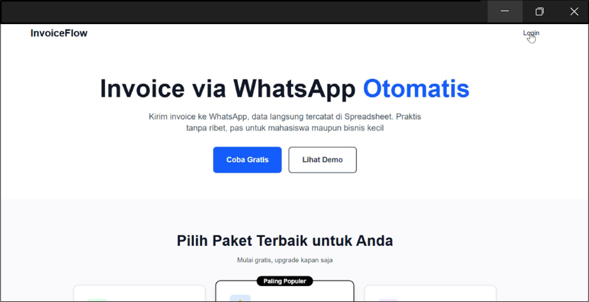

# 📄 Auto Invoice

## 🚀 Core Solution
**Auto Invoice** adalah solusi otomatisasi berbasis WhatsApp Bot yang dapat menerima foto invoice, mengekstrak data menggunakan **OCR + LLM**, dan langsung memasukkannya ke **Google Spreadsheet**.

## ⚙️ Work Mechanism
1. User mengirimkan foto invoice melalui **WhatsApp**.  
2. Bot mengunduh dan memproses gambar menggunakan **EasyOCR**.  
3. Hasil teks OCR diproses oleh **LLaMA** untuk melakukan **structured extraction** (misalnya: nomor invoice, tanggal, total, dll).  
4. Data hasil ekstraksi otomatis dimasukkan ke **Google Spreadsheet** milik user.  
5. User dapat mengelola **multiple spreadsheet** melalui **web dashboard**.  

## 🛠️ Tech Stack
- **Backend**: Node.js + Express  
- **OCR**: EasyOCR  
- **LLM**: LLaMA  
- **Database**: PostgreSQL  
- **Integration**: Google Sheets API, WhatsApp API (Baileys)  
- **Dashboard**: Next.js  

## 🌟 Features
- 📷 Kirim invoice via WhatsApp → data otomatis tersimpan  
- 🤖 OCR + AI untuk ekstraksi data terstruktur  
- 📊 Integrasi langsung ke Google Spreadsheet  
- 🗂️ Dukungan multiple spreadsheet per user  
- 🌐 Web dashboard untuk manajemen data  

## 🚧 Roadmap
- [ ] Tambah dukungan multi-format invoice (PDF, DOCX)  
- [ ] Ekspor data ke format lain (CSV, Excel)  
- [ ] Analitik dasar (jumlah invoice, total bulanan)  

---

💡 **Auto Invoice** membantu bisnis kecil maupun besar mengurangi pekerjaan manual dalam pencatatan keuangan, membuat proses lebih cepat, akurat, dan efisien.  

---

## 📊 System Flow

